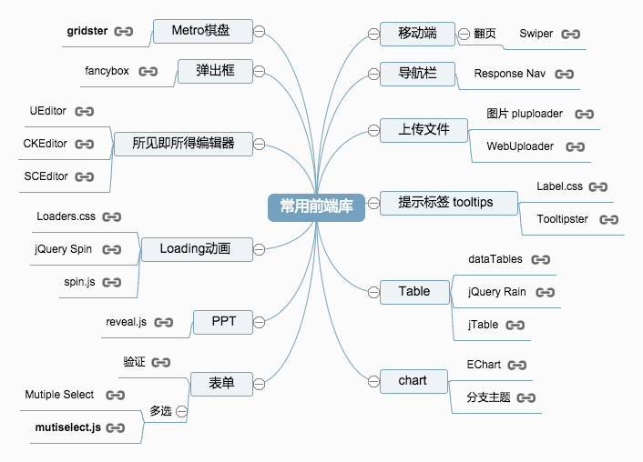

# frontend-useful-plugin

此列表将陈列出一些前端常用的第三方库

可视化支持 - [百度脑图](http://naotu.baidu.com/viewshare.html?shareId=av9qeg7w1008)

- 桌面端
	- 弹出框
		- [fancyBox](http://fancyapps.com/fancybox/)
	- 导航栏
		- [Response Nav](http://responsive-nav.com/)
	- 上传文件
		- 上传图片 [PlUploader](http://www.plupload.com/examples/core)
		- [WebUploader](http://fex.baidu.com/webuploader/)
	- 提示标签 Tooltips
		- [Label.css](http://usablica.github.io/label.css/)
		- [tooltipster](http://iamceege.github.io/tooltipster/)
	- 表格
		- [datatables](http://datatables.net/)
		- [jQuery Rain](http://www.jqueryrain.com/?0A2TccNA)
		- [jTable](http://www.jtable.org/Demo/MasterChild)
	- 图表
		- [ECharts](http://echarts.baidu.com/)
		- [d3.js](http://d3js.org/)
	- 所见即所得编辑器
		- [UEditor](http://ueditor.baidu.com/website/)
		- [CKEditor](http://ckeditor.com/)
		- [SCEditor](http://www.sceditor.com/)
	- Metro棋盘
		- [grister](http://gridster.net/)
	- Loading动画
		- [Loaders.css](http://connoratherton.com/loaders)
		- [jQuery Spin](http://ksylvest.github.io/jquery-spin/)
		- [spin.js](http://fgnass.github.io/spin.js/)
	- PPT
		- [reveal.js](http://lab.hakim.se/reveal-js/#/)
	- 表单
		- 表单验证 - [html5 pattern](http://html5pattern.com/)
		- 多选
			- [Mutiple Select](http://wenzhixin.net.cn/p/multiple-select/docs/) 
			- [mutiselect.js](http://loudev.com/)
- 移动端
	- 翻页
		- [Swiper](http://www.idangero.us/sliders/swiper/)
